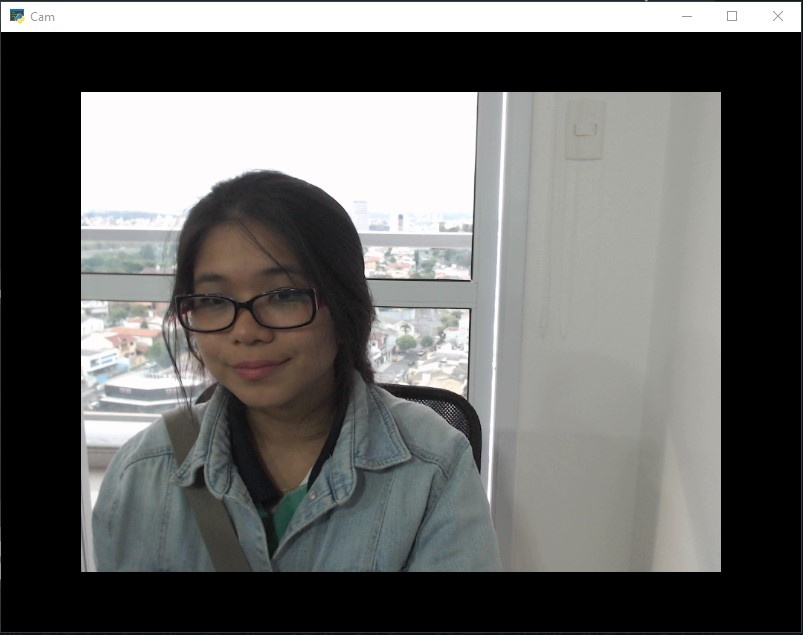

<h1 align="center"> Kivy - Camera  </h1>

    Access camera in Kivy.

  <a href="#-technologies">Technologies</a>&nbsp;&nbsp;&nbsp;|&nbsp;&nbsp;&nbsp;
  <a href="#-project">Project</a>&nbsp;&nbsp;&nbsp;|&nbsp;&nbsp;&nbsp;
  <a href="#-references">References</a>&nbsp;&nbsp;&nbsp;|&nbsp;&nbsp;&nbsp;
  <a href="#memo-licence">Licence</a>

  

 

## Screen

    

## 🚀 Technologies

This project was developed with the following technologies:

- [Python](https://www.python.org/)
- [Library - Kivy](https://kivy.org/)

## 💻 Project

Project to acess camera

START - PIP
- pip i kivy cv2 

PYTHON
- Extension to run in VSCode: Python and Pylance

Links Usefull:

 Python Download - https://www.python.org/downloads/

 VSCode Download -  https://code.visualstudio.com/download

## 🔖 References

https://kivy.org/doc/stable/examples/gen__camera__main__py.html

## :memo: Licence

This project is under the MIT license.

---

Made with ♥ by Karoline :wave: [Let's program together!](https://www.linkedin.com/in/karoline-hikari-yamamoto/)

